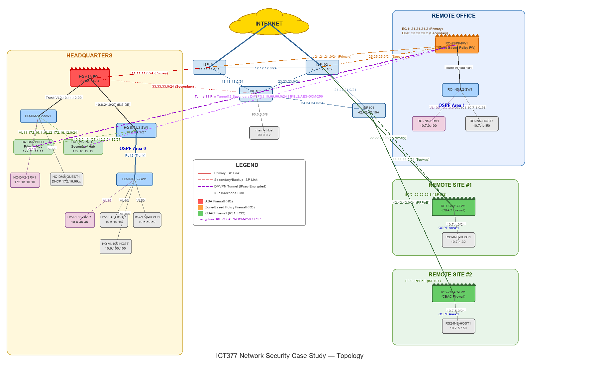

# Enterprise Network Security Case Study

Multi-site enterprise network security implementation featuring three distinct firewall architectures protecting a DMVPN overlay with dual-ISP redundancy.

## Topology



## Network Architecture

| Site | Firewall Type | Key Security Features |
|------|--------------|----------------------|
| **HQ** | Cisco ASA (Adaptive Security Appliance) | Dual outside interfaces, object NAT, per-ISP ACLs, SLA-based failover |
| **Remote Office** | Zone-Based Policy Firewall (ZBPF) | IKEv2/AES-GCM-256 IPsec, zone-pair inspection, dual-ISP NAT/PAT with route-maps |
| **Remote Site 2** | Context-Based Access Control (CBAC) | Stateful packet inspection, DMVPN spoke, PPPoE secondary WAN |

## Topology Overview

- **WAN Transport:** Dual-ISP links per site (ISP101/ISP103 at HQ, ISP101/ISP102 at remote sites)
- **Overlay:** DMVPN Phase 3 with dual hub/spoke tunnels (Tunnel11 primary, Tunnel12 secondary)
- **Encryption:** IKEv2 with AES-GCM-256 transform sets, pre-shared key authentication
- **Routing:** Multi-area OSPF (Area 0 backbone, Area 1 remote office, Area 2 DMZ management)
- **Redundancy:** IP SLA monitoring with object tracking for automatic ISP failover

## IP Addressing Scheme

| Network | Range | Purpose |
|---------|-------|---------|
| 10.6.0.0/16 | HQ internal | VLANs 35, 40, 50, 100 + management |
| 10.7.0.0/16 | Remote Office internal | VLANs 100, 101 |
| 172.16.11.0/24 | DMZ | DMVPN Hub 11 (primary) |
| 172.16.12.0/24 | DMZ | DMVPN Hub 12 (secondary) |
| 172.16.99.0/24 | DMZ | Guest network |
| 10.66.64.0/24 | Tunnel11 | Primary DMVPN overlay |
| 10.66.66.0/24 | Tunnel12 | Secondary DMVPN overlay |
| 11.11.11.0/24 | ISP101 | Primary ISP at HQ |
| 33.33.33.0/24 | ISP103 | Secondary ISP at HQ |

## Directory Structure

```
completed-configs/          # Configured firewall devices (my work)
  HQ/HQ-ASA-FW1.cfg        # ASA firewall - dual ISP, object NAT, DMVPN ACLs
  RO/RO-ZBPF-FW1.cfg       # Zone-Based Policy Firewall - IKEv2, zone-pair security
  RS2/RS2-CBAC-FW1.cfg      # CBAC firewall - stateful inspection, PPPoE WAN
base-configs/               # Starting topology configs (pre-security)
  HQ/                       # HQ switches, DMVPN hubs, hosts, servers
  RO/                       # Remote Office switch, host, server
  RS/                       # Remote Sites 1 & 2 base configs
  ISP/                      # ISP routers and internet host
docs/
  practical-exam-configs.md # 7 security tickets: ACLs, ZBPF policies, NAT, DMVPN fixes
```

## Technical Skills Demonstrated

| Category | Technologies |
|----------|-------------|
| Firewall Platforms | Cisco ASA, IOS Zone-Based Policy Firewall, IOS CBAC |
| VPN | DMVPN Phase 3, IKEv2, AES-GCM-256, ESP, NHRP |
| NAT/PAT | Object NAT (ASA), route-map based PAT (IOS), static NAT for DMVPN hubs |
| Routing | Multi-area OSPF, passive interfaces, default route origination |
| High Availability | Dual-ISP with IP SLA tracking, floating static routes |
| Access Control | Extended ACLs, per-VLAN traffic policies, zone-pair inspection rules |
| WAN | Dual ISP, PPPoE, GRE multipoint tunnels |

## Tools

- **EVE-NG** - Network emulation platform
- **Cisco IOS 15.7** - Router/switch operating system
- **Cisco ASA 9.x** - Firewall operating system

## Context

Enterprise network security project implementing production-grade security across a multi-site topology. Each site uses a different firewall technology to demonstrate comparative understanding of Cisco security platforms.
